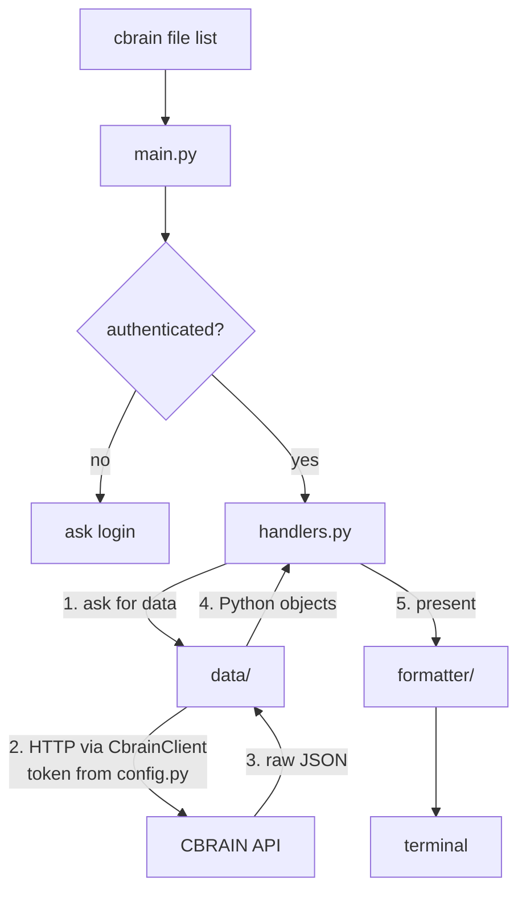

# Welcome to the CBRAIN CLI Package!

This directory is the heart of the `cbrain` command — parse input, check the session, talk to CBRAIN, and print a clean result.

## How It Fits Together

**Parse → Auth → Handle → Fetch → Format.**

| Piece | Role |
| --- | --- |
| `main.py` | Build the parser, gate auth, dispatch |
| `sessions.py` / `config.py` | Login, logout, credential file |
| `handlers.py` | Call data, then formatter; set exit codes |
| [`data/`](data/README.md) | BrainPortal API calls (no printing) |
| [`formatter/`](formatter/README.md) | Tables, summaries, `--json`, `--jsonl` |
| `cli_utils.py` | `CbrainClient`, errors, pagination, output helpers |
| `users.py` | Current-user helpers for `whoami` |

## A Quick Mental Model

Use `CbrainClient` for new API calls. Credentials load at command time via `from_credentials()` — never at import.

## Golden Rules ✨

* **Data never prints** — validate and return objects only.
* **Formatters own presentation** — including `--json` / `--jsonl`.
* **Handlers glue both** — exit codes and `--yes` for destructive actions.
